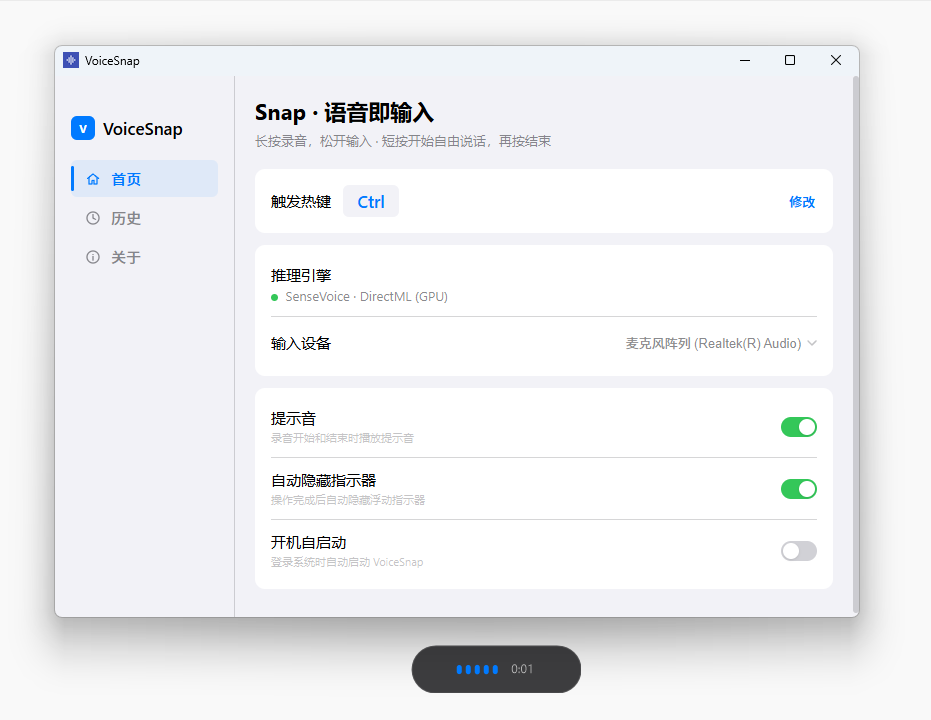

# VoiceSnap 语闪 - C# WPF 版本

> 长按说话，松手即输 —— 离线 · 极速 · 精准



## ✨ 版本历史

### v1.3.2 (2026-01-21)
- 🚀 **彻底移除 Python 依赖**：实现纯原生 C# + C++ 引擎，安装包更精简。
- 🛠️ **原生剪贴板重构**：引入 Win32 API 写入剪贴板，彻底解决 `CLIPBRD_E_CANT_OPEN` 导致的锁死。
- ⌨️ **新增“模拟打字”模式**：支持直接发送 Unicode 字符，解决同花顺、交易终端等软件无法粘贴的问题。
- 🎯 **焦点保护机制**：引入 `WS_EX_NOACTIVATE`，确保指示器窗口永远不会抢夺当前输入框焦点。
- 📦 **自动集成运行库**：打包时自动提取并集成 VC++ Redistributable DLL，真正实现开箱即用。

### v1.3.1 (2026-01-02)
- 🔧 修复剪贴板偶发锁定导致的错误弹窗
- 🔧 修复 Ctrl 键与粘贴操作冲突导致的偶发卡住
- 🔧 修复 ONNX Stream 内存泄漏问题
- ⚡ 新增安全粘贴机制：等待用户松开按键后再执行
- ⚡ 新增空闲 30 秒自动内存回收机制
- 📉 优化长时间使用的内存占用
- 📉 移除不必要的日志输出，减少日志文件增长

### v1.3.0
- 🚀 新增 DirectML 硬件加速 (自动检测 GPU/CPU)
- 🔄 新增应用内自动更新功能
- 🎤 新增 VAD 能量检测，静音时跳过识别
- 🔌 新增音频设备热插拔支持
- 🌐 新增双地址模型下载备份机制

## 🚀 特性亮点

| 特性 | 说明 |
|-----|------|
| **启动速度** | 0.1-0.3 秒 ⚡ |
| **打包体积** | ~80 MB (自包含运行时) |
| **运行模式** | 完全离线，无需网络，**彻底移除 Python 依赖** |
| **输入模式** | 支持 **剪贴板粘贴** 与 **模拟打字** 双模式 |
| **硬件加速** | 自动检测 DirectML GPU 加速 |
| **用户安装** | 双击即用，内置 VC++ 运行库，无需安装任何依赖 ✅ |

## 🏗️ 架构设计

```
┌─────────────────────────────────────────────────┐
│  C# WPF UI (极速启动)                            │
│  • 浮动指示器 (半透明胶囊 + 声纹动画)              │
│  • 系统托盘常驻                                  │
│  • 全局快捷键监听 (自定义按键)                    │
│  • 剪贴板重试机制                                │
│  • 空闲内存自动回收                              │
└───────────────────┬─────────────────────────────┘
                    │ 直接调用
                    ▼
┌─────────────────────────────────────────────────┐
│  VoiceSnap.Engine (原生 ONNX Runtime)            │
│  • SherpaOnnx SenseVoice 模型                   │
│  • DirectML GPU 加速 / CPU 回退                  │
│  • 16kHz 单声道 PCM 输入                         │
└─────────────────────────────────────────────────┘
```

## 🛠️ 开发环境

### 环境要求

- Windows 10/11 (x64)
- .NET 8.0 SDK ([下载](https://dotnet.microsoft.com/download/dotnet/8.0))

### 快速开始

```bash
# 1. 还原依赖
dotnet restore

# 2. 运行 (开发模式)
dotnet run

# 3. 编译发布版
dotnet publish -c Release -o publish
```

## 📁 项目结构

```
Fun-ASR/
├── VoiceSnapWPF/                 # 主应用项目
│   ├── VoiceSnap.csproj          # 项目文件
│   ├── App.xaml                  # 应用入口
│   ├── MainWindow.xaml           # 主窗口 (设置界面)
│   ├── MainWindow.xaml.cs        # 主窗口逻辑
│   ├── FloatingIndicator.xaml    # 浮动指示器
│   ├── AudioRecorder.cs          # 音频录制 (NAudio)
│   ├── Assets/
│   │   └── icon.ico              # 应用图标
│   └── publish/                  # 发布输出目录
│
├── VoiceSnap.Engine/             # 原生识别引擎
│   └── AsrEngine.cs              # ONNX 推理封装
│
└── VoiceSnap_Release/            # 发布版本
    ├── VoiceSnap.exe             # 可执行文件
    └── version.json              # 版本信息 (用于自动更新)
```

## 🎯 使用方法

1. 首次启动自动下载语音模型 (~200MB)
2. 加载完成后，指示器显示 🟢 "长按 Ctrl 说话"
3. 在任意输入框中长按 **Ctrl** 键 (可在设置中更改)
4. 指示器变 🔴 红，显示声纹波形
5. 松开按键，指示器变 🟠 "识别中"
6. 识别完成后自动粘贴文字到光标位置

## ⚙️ 设置选项

- **快捷键**: 支持自定义触发按键 (Ctrl/Alt/Shift/任意键)
- **自动隐藏**: 识别完成后自动隐藏指示器
- **开机启动**: 开机自动运行
- **检查更新**: 应用内一键更新

## 📦 依赖库

- [NAudio](https://github.com/naudio/NAudio) - 音频录制
- [SherpaOnnx](https://github.com/k2-fsa/sherpa-onnx) - 语音识别引擎
- [Hardcodet.NotifyIcon.Wpf](https://github.com/hardcodet/wpf-notifyicon) - 系统托盘
- ONNX Runtime + DirectML - 硬件加速推理

## 📄 许可证

MIT License
