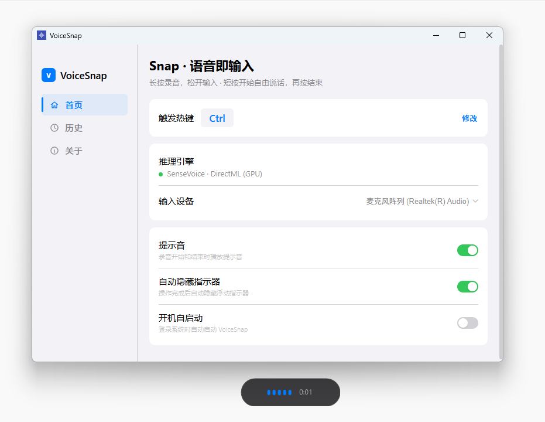

# VoiceSnap 语闪

> 长按说话，松手即输 —— 离线 · 极速 · 跨平台



VoiceSnap 是一款离线语音转文字工具。按住快捷键说话，松开即识别并输入文字到任意应用。无需联网，无需注册，开箱即用。

## 两个版本

| | **v2.0 Go** (推荐) | **v1.x WPF** |
|---|---|---|
| 技术栈 | Go + Wails v3 + Svelte | C# + WPF + .NET 8 |
| 平台 | Windows（Mac/Linux 计划中） | 仅 Windows |
| 体积 | ~34 MB (exe + DLL) | ~80 MB |
| 内存 | ~400 MB（含模型） | ~500 MB |
| UI 风格 | Apple Design，现代 Web | WPF 原生 |
| 目录 | [`VoiceSnapGo/`](VoiceSnapGo/) | [`VoiceSnapWPF/`](VoiceSnapWPF/) |

## 核心特性

- **完全离线** — SenseVoice 模型本地推理，无数据上传
- **DirectML GPU 加速** — 自动检测显卡，CPU 自动回退
- **两种输入模式** — 长按说话 + 短按自由说话
- **自定义快捷键** — 支持 Ctrl / Alt / Shift / 功能键 / 字母键
- **麦克风选择** — 下拉切换输入设备
- **录音音效** — 马林巴风格提示音（可关闭）
- **录音计时** — 指示器实时显示录音时长（0:00 → 0:03 → ...）
- **Escape 取消** — 录音中按 Esc 立即取消
- **剪贴板保护** — 粘贴后自动恢复原剪贴板内容
- **识别历史** — 自动保存最近 50 条，可复制、删除、设置保留时长
- **中英混合优化** — 自动在中英文之间加空格，句首大写
- **指示器可拖拽** — 拖动浮动指示器到任意位置，自动记忆
- **中英双语界面** — 自动跟随系统语言
- **系统托盘常驻** — 关闭窗口不退出
- **开机自启** — 可选

## 快速开始

### 用户

1. 从 [Releases](https://github.com/vorojar/VoiceSnap/releases) 下载最新版本
2. 解压到任意目录，双击 `voicesnap.exe`
3. 首次启动自动下载语音模型（~200 MB）
4. 就绪后，在任意输入框中按住 **右 Ctrl** 说话，松开即输入

### 开发者 (Go 版本)

```bash
# 环境要求
# - Go 1.22+
# - Node.js 20+
# - CGO 编译器 (Windows: LLVM MinGW UCRT)

# 克隆
git clone https://github.com/vorojar/VoiceSnap.git
cd VoiceSnap/VoiceSnapGo

# 安装前端依赖
cd frontend && npm install && cd ..

# 开发模式
wails3 dev

# 生产构建
CGO_ENABLED=1 go build -ldflags "-H windowsgui -s -w" -o voicesnap.exe .
```

### 开发者 (WPF 版本)

```bash
cd VoiceSnap/VoiceSnapWPF
dotnet restore
dotnet run
```

## 使用方法

1. 系统托盘出现 VoiceSnap 图标，引擎加载完成后就绪
2. **长按模式**：按住快捷键说话，松开即识别并粘贴
3. **自由说话**：短按一下开始，连续说话，再短按一下停止
4. **取消录音**：录音中按 Esc
5. 右键托盘图标可打开设置或退出

## 运行文件

| 文件 | 大小 | 说明 |
|---|---|---|
| `voicesnap.exe` | ~15 MB | 主程序 |
| `onnxruntime.dll` | ~15 MB | ONNX Runtime |
| `sherpa-onnx-c-api.dll` | ~4 MB | sherpa-onnx C API |
| `sherpa-onnx-cxx-api.dll` | ~248 KB | sherpa-onnx C++ API |
| `models/sensevoice/` | ~200 MB | 语音模型（首次自动下载） |

## 项目结构

```
VoiceSnap/
├── VoiceSnapGo/              # v2.0 Go + Wails v3 + Svelte
│   ├── main.go               # 入口：单实例 + Wails 启动
│   ├── app.go                # 编排：热键 → 录音 → 识别 → 粘贴
│   ├── internal/
│   │   ├── audio/            # malgo 录音 + 设备枚举
│   │   ├── engine/           # sherpa-onnx 推理
│   │   ├── hotkey/           # 全局热键轮询
│   │   ├── input/            # 剪贴板 + 粘贴 + 剪贴板保护
│   │   ├── config/           # JSON 配置
│   │   ├── history/          # 识别历史（JSON 持久化）
│   │   ├── textproc/         # 中英混合文本后处理
│   │   ├── sound/            # 录音音效（合成 WAV）
│   │   ├── overlay/          # Win32 浮动指示器
│   │   └── ...
│   ├── services/             # Wails 服务（前端绑定）
│   └── frontend/             # Svelte + Vite
│       ├── src/components/   # 设置窗口 + 指示器
│       └── src/lib/          # stores + i18n
│
├── VoiceSnapWPF/             # v1.x C# WPF 版本
│   ├── VoiceSnap.csproj
│   ├── MainWindow.xaml
│   └── ...
│
├── VoiceSnap.Engine/         # 原生识别引擎 (WPF 版)
└── screenshot.png
```

## 技术栈 (Go 版本)

| 组件 | 技术 |
|---|---|
| 桌面框架 | [Wails v3](https://wails.io/) |
| 前端 | [Svelte 5](https://svelte.dev/) + Vite + TypeScript |
| 音频录制 | [malgo](https://github.com/gen2brain/malgo) (miniaudio) |
| 语音识别 | [sherpa-onnx](https://github.com/k2-fsa/sherpa-onnx) (SenseVoice) |
| 全局热键 | Win32 GetAsyncKeyState 轮询 |
| 文字输入 | Win32 剪贴板 + SendInput |
| 浮动指示器 | Win32 GDI+ Layered Window |
| 音效 | 程序合成 WAV + winmm PlaySound |

## 许可证

MIT License

## 致谢

- [SherpaOnnx](https://github.com/k2-fsa/sherpa-onnx) — 语音识别引擎
- [Wails](https://wails.io/) — Go 桌面应用框架
- [SenseVoice](https://github.com/FunAudioLLM/SenseVoice) — 语音模型
